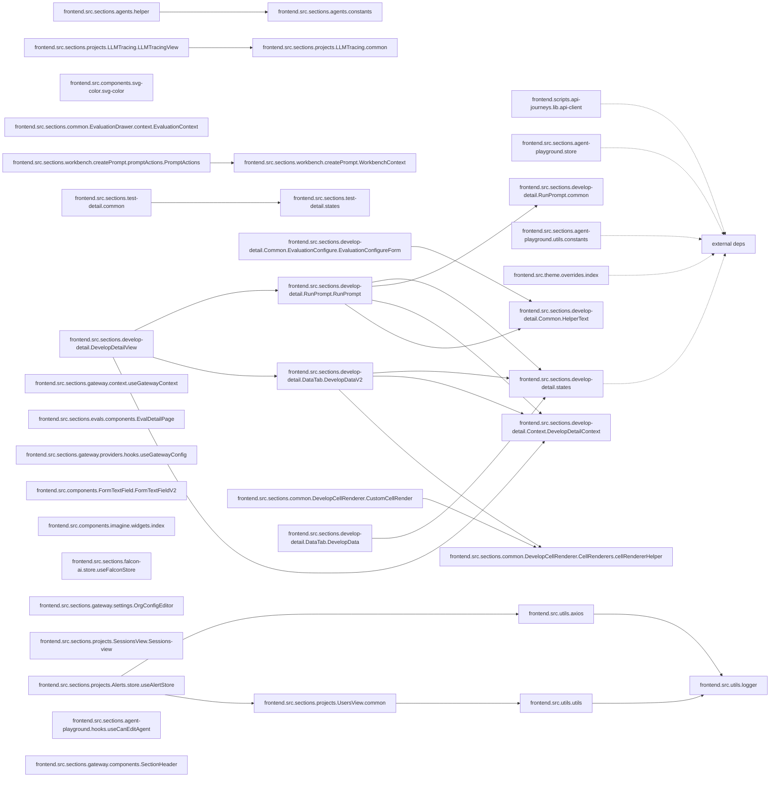

# Architecture — `future-agi`

> Auto-generated by `repo-archaeologist`. Heuristic; treat as a starting map, not ground truth.

## Tech Stack

| Language | LOC | Share |
|---|---:|---:|
| JavaScript | 986,611 | 47.3% |
| Python | 861,132 | 41.3% |
| Go | 113,745 | 5.5% |
| TypeScript | 113,176 | 5.4% |
| Shell | 3,793 | 0.2% |
| HTML | 2,398 | 0.1% |
| SQL | 2,287 | 0.1% |
| CSS | 1,864 | 0.1% |
| Other | 477 | 0.0% |
| Lua | 24 | 0.0% |

**Total source LOC:** 2,085,507 across 7889 source files (9760 files total).

## Entry Points

- `bin/install`
- `bin/install.ps1`

## Dependencies

**2 dependencies** across 1 ecosystem(s): npm.

### npm (2)

| Package | Version |
|---|---|
| husky | ^9.1.7 |
| lint-staged | ^16.1.2 |

## Top-Level Layout

```
future-agi/
- .husky/
- agentcc-gateway/  (398 source files)
- api_contracts/
- bin/
- deploy/  (1 source files)
- docs/
- fi-collector/  (42 source files)
- frontend/  (3975 source files)
- futureagi/  (3462 source files)
- scripts/  (9 source files)
- .dockerignore
- .env.example
- .lintstagedrc.cjs
- .release-please-manifest.json
- BRANCH_NAMING_CONVENTION.md
- CHANGELOG.md
- CONTRIBUTING.md
- Dockerfile
- Dockerfile.base
- Dockerfile.oss
- Dockerfile.simulation-runner
- Dockerfile.simulation-runner.dev
- INSTALLATION.md
- LICENSE
- LICENSE-EE
- NOTICE
- README.md
- SECURITY.md
- TESTING.md
- docker-compose.dev.yml
- docker-compose.frontend.yml
- docker-compose.yml
- package.json
- release-please-config.json
- yarn.lock
```

## Module Breakdown

| Directory | Source files |
|---|---:|
| frontend | 3975 |
| futureagi | 3462 |
| agentcc-gateway | 398 |
| fi-collector | 42 |
| scripts | 9 |
| Dockerfile | 1 |
| .lintstagedrc.cjs | 1 |
| deploy | 1 |

## Dependency Diagram

_Best-effort module dependency graph from static imports. Local modules only; external dependencies are collapsed._



## Dead Code Estimate

**3570 module(s) appear unreferenced** out of 5980 candidate(s). These are source files no other file imports or requires. Verify before deleting — dynamic imports and entry points may not be detected.

| File | Language |
|---|---|
| `.lintstagedrc.cjs` | JavaScript |
| `frontend/.eslintrc.cjs` | JavaScript |
| `frontend/.storybook/preview.jsx` | JavaScript |
| `frontend/public/config.js` | JavaScript |
| `frontend/public/mockServiceWorker.js` | JavaScript |
| `frontend/public/service-worker.js` | JavaScript |
| `frontend/scripts/api-journeys/browser/agents-list-create-delete-smoke.mjs` | JavaScript |
| `frontend/scripts/api-journeys/browser/agents-playground-smoke.mjs` | JavaScript |
| `frontend/scripts/api-journeys/browser/agents-playground-versions-smoke.mjs` | JavaScript |
| `frontend/scripts/api-journeys/browser/alerts-lifecycle-mutation-smoke.mjs` | JavaScript |
| `frontend/scripts/api-journeys/browser/alerts-smoke.mjs` | JavaScript |
| `frontend/scripts/api-journeys/browser/annotation-add-items-checkbox-nudge-smoke.mjs` | JavaScript |
| `frontend/scripts/api-journeys/browser/annotation-auto-assign-edit-smoke.mjs` | JavaScript |
| `frontend/scripts/api-journeys/browser/annotation-bulk-assign-smoke.mjs` | JavaScript |
| `frontend/scripts/api-journeys/browser/annotation-completed-navigation-smoke.mjs` | JavaScript |
| `frontend/scripts/api-journeys/browser/annotation-content-copy-smoke.mjs` | JavaScript |
| `frontend/scripts/api-journeys/browser/annotation-dataset-search-smoke.mjs` | JavaScript |
| `frontend/scripts/api-journeys/browser/annotation-direct-call-queue-source-smoke.mjs` | JavaScript |
| `frontend/scripts/api-journeys/browser/annotation-falcon-context-smoke.mjs` | JavaScript |
| `frontend/scripts/api-journeys/browser/annotation-label-archive-restore-smoke.mjs` | JavaScript |
| `frontend/scripts/api-journeys/browser/annotation-label-picker-smoke.mjs` | JavaScript |
| `frontend/scripts/api-journeys/browser/annotation-queue-create-duplicate-drawer-smoke.mjs` | JavaScript |
| `frontend/scripts/api-journeys/browser/annotation-queue-disabled-smoke.mjs` | JavaScript |
| `frontend/scripts/api-journeys/browser/annotation-queue-export-download-smoke.mjs` | JavaScript |
| `frontend/scripts/api-journeys/browser/annotation-queue-limit-message-smoke.mjs` | JavaScript |
| `frontend/scripts/api-journeys/browser/annotation-queue-metrics-panels-smoke.mjs` | JavaScript |
| `frontend/scripts/api-journeys/browser/annotation-queues-list-search-detail-smoke.mjs` | JavaScript |
| `frontend/scripts/api-journeys/browser/annotation-review-flow-smoke.mjs` | JavaScript |
| `frontend/scripts/api-journeys/browser/annotation-rule-run-now-smoke.mjs` | JavaScript |
| `frontend/scripts/api-journeys/browser/annotation-self-review-block-smoke.mjs` | JavaScript |
| `frontend/scripts/api-journeys/browser/annotation-session-select-all-smoke.mjs` | JavaScript |
| `frontend/scripts/api-journeys/browser/annotation-session-trace-id-smoke.mjs` | JavaScript |
| `frontend/scripts/api-journeys/browser/annotation-settings-back-smoke.mjs` | JavaScript |
| `frontend/scripts/api-journeys/browser/annotation-simulation-content-smoke.mjs` | JavaScript |
| `frontend/scripts/api-journeys/browser/annotation-stale-value-reset-smoke.mjs` | JavaScript |
| `frontend/scripts/api-journeys/browser/annotation-submit-workflow-smoke.mjs` | JavaScript |
| `frontend/scripts/api-journeys/browser/annotation-viewer-role-write-smoke.mjs` | JavaScript |
| `frontend/scripts/api-journeys/browser/annotation-workspace-layout-smoke.mjs` | JavaScript |
| `frontend/scripts/api-journeys/browser/composite-eval-create-smoke.mjs` | JavaScript |
| `frontend/scripts/api-journeys/browser/composite-eval-smoke.mjs` | JavaScript |
| `frontend/scripts/api-journeys/browser/dashboard-list-detail-date-smoke.mjs` | JavaScript |
| `frontend/scripts/api-journeys/browser/dashboard-query-share-state-smoke.mjs` | JavaScript |
| `frontend/scripts/api-journeys/browser/dashboard-widget-editor-smoke.mjs` | JavaScript |
| `frontend/scripts/api-journeys/browser/dataset-add-static-column-detail-smoke.mjs` | JavaScript |
| `frontend/scripts/api-journeys/browser/dataset-annotations-preview-smoke.mjs` | JavaScript |
| `frontend/scripts/api-journeys/browser/dataset-clone-list-action-smoke.mjs` | JavaScript |
| `frontend/scripts/api-journeys/browser/dataset-column-menu-detail-smoke.mjs` | JavaScript |
| `frontend/scripts/api-journeys/browser/dataset-copy-new-detail-smoke.mjs` | JavaScript |
| `frontend/scripts/api-journeys/browser/dataset-duplicate-rows-detail-smoke.mjs` | JavaScript |
| `frontend/scripts/api-journeys/browser/dataset-edit-column-type-detail-smoke.mjs` | JavaScript |

_…and 3520 more._

## Largest Source Files

| File | LOC |
|---|---:|
| frontend/src/api/contracts/openapi-contract.generated.js | 102,155 |
| frontend/src/generated/api-contracts/api.ts | 55,292 |
| frontend/scripts/api-journeys/journeys/datasets-evals.mjs | 36,505 |
| frontend/src/generated/api-contracts/api.zod.ts | 34,170 |
| frontend/src/generated/api-contracts/api.schemas.ts | 23,606 |
| frontend/scripts/api-journeys/journeys/app-core.mjs | 19,174 |
| frontend/scripts/api-journeys/journeys/annotation-queues.mjs | 15,509 |
| futureagi/model_hub/views/develop_dataset.py | 14,223 |
| frontend/scripts/api-journeys/journeys/simulation-agentcc.mjs | 14,212 |
| frontend/scripts/api-journeys/journeys/observe-filters.mjs | 13,057 |

## Project Hygiene

| Signal | Status |
|---|---|
| README | present |
| LICENSE | present |
| CI config | present |
| Dockerfile | present |
| Lockfile | present |
| Tests | detected |
